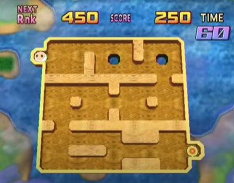

 

Sommaire

1. [3D Ball Maze](#3d-ball-maze)
2. [Statut](#statut)
3. [Projet](#projet)
4. [Inspiration](#inspiration)
5. [Contact](#contact)

# 3D Ball Maze 

Code source d'un jeu mobile/web à venir.

3D Ball Maze est un jeu grand public (casual) dont le but est d'amener une balle à l'objectif le plus vite possible en orientant son téléphone pour incliner et traverser un labyrinthe en veillant à éviter les divers obstacles.

Le jeu est développé en C# avec le moteur de jeu Unity 3D.

# Statut

Le projet est en cours de développement (débuté en décembre 2023). Il est actuellement en phase de prototypage pour valider l'idée et s'assurer que celui-ci est intéressant et amusant.

# Projet 

Je travaille sur ce projet depuis décembre 2023 (j'ai commencé à travailler dessus en 2022 mais j'ai dû arrêté à cause d'une charge de travail trop importante de janvier à juillet 2022 ainsi que pour travailler sur un autre projet : [Social Media Simulator](https://github.com/Quentin-Chauvelon/Social_Media_Simulator)). J'ai recommencé à travailler sur ce projet fin 2023 en repartant de zéro car je n'étais pas satisfait du code que j'avais écrit en 2022 (c'était la première fois que je codais en C#).

J'ai appris le C# par moi-même en travaillant sur la première version du projet en 2022 et en lisant [Apprenez à développer en C#](https://www.fnac.com/a8267393/Nicolas-Hilaire-Apprenez-a-developper-en-c) écrit par Nicolas Hilaire.

Travaillant seul sur ce projet, j'ai du m'occuper de tous les ascpects du jeu : développement, design de l'interface graphique, modélisation 3D, tests, résolution de bugs... ce qui va me permettre d'apprendre et de m'améliorer dans tous ces domaines.

# Inspiration

Ce projet est inspiré d'un mini-jeu nommé Tilt Maze du jeu Bomberman Land Wii.

Dans ce jeu, vous devez faire pivoter votre télécommande Wii pour incliner le labyrinthe et faire rouler la balle (en haut à gauche de l'image) jusqu'à l'objectif (en bas à droite de l'image) dans le temps imparti. Il y a plusieurs niveaux qui augmentent en difficulté.

*Capture d'écran prise de [Let's Play Bomberman Land Wii part 13 "Enter the Star Zone!"](https://www.youtube.com/watch?v=gYOpMycheL0&t=1719s) par ackieforest* 

J'aimais beaucoup jouer à ce jeu quand j'étais plus jeune et je souhaite essayer de faire une version plus moderne de celui-ci en y ajoutant des fonctionnalités que l'on peut retrouver dans la plupart des jeux actuels :

- Elements sociaux tels que jouer avec ses amis
- Nouveaux niveaux tous les jours
- Niveaux avec classements
- Cosmétiques tels que des skins
- Multijoueur
- Evènements avec des mécaniques de jeu personnalisées
- Et bien plus...

# Contact 

Email: [quentin.chauvelon@gmail.com](mailto:quentin.chauvelon@gmail.com) 

LinkedIn: [Quentin Chauvelon](https://www.linkedin.com/in/quentin-chauvelon/) 